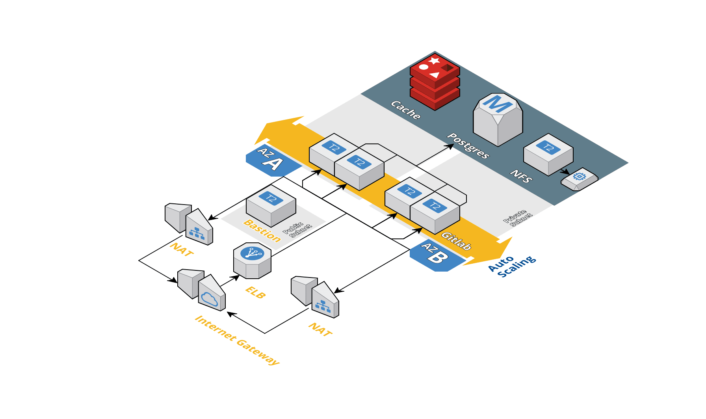

# Gitlab + AWS + Terraform
> Hosting your own gitlab on AWS

### Table of contents
- [Architecture](#Architecture)
- [Pre-requisite](#Pre-requisite)
- [Usage](#Usage)
- [Task](#Task)
- [Resource](#Resource)

### Architecture


Description
- High availability architecture span across two regions
- Bastion server to access private instances
- Using postgres database as recommended
- Using NFS as recommended (NFS is built on EC2 with EBS)

### Pre-requisite

**Hostname**

Host name is required to host gitlab.
It will be mapped to the DNS of the load balancer.
One option is to use AWS route 53 as the host zones.

**Terraform aws access**

Create a user for terraform with the following permission:
- RDS
- ElastiCache
- EC2

**Key Pair**

Create a key pair to access into EC2 Instances

### Usage

Edit configuration file:
> terraform.tvars

```
### Config file

## AWS Configuration
# Region for the vpc
region              = "ap-southeast-1"
# Availability zones to achive high availability
availability_zone_a = "ap-southeast-1a"
availability_zone_b = "ap-southeast-1b"
# Ami to host gitlab instances
ami                 = "ami-xxxxxx"
# Key name for terraform to provision ec2 instances
key_name            = "key_name"

## Networking
vpc_cidr_block              = "10.0.0.0/16"
public_subnet_CIDR_block_a  = "10.0.1.0/24"
public_subnet_CIDR_block_b  = "10.0.2.0/24"
private_subnet_CIDR_block_a = "10.0.3.0/24"
private_subnet_CIDR_block_b = "10.0.4.0/24"

## Gitlab Configuration
# URL
gitlab_url          = "http://gitlab.domain.com/"
gitlab_docker_image = "gitlab/gitlab-ce:11.1.4-ce.0"
# DB
db_name             = "gitlab_db"
db_user             = "gitlab_user"
db_password         = "gitlab_password"
```

Configure AWS CLI

The AWS CLI will prompt you for four pieces of information. AWS Access Key ID and AWS Secret Access Key are your account credentials.
[More info](https://docs.aws.amazon.com/cli/latest/userguide/cli-chap-getting-started.html)
```
aws configure
```

Deploy resources on AWS
```
terraform plan
terraform apply
```

## Task

Pending task

- [ ] Parameterised RDS and cache param
- [ ] Parameterised cache param
- [ ] Parameterised Gitlab instance param
- [ ] Parameterised NFS instance param
- [ ] Add in Route 53 attached to EBS


## Resources

[Official Gitlab Guide](https://docs.gitlab.com/ee/university/high-availability/aws/)

[Intro to terraform](https://hackernoon.com/introduction-to-aws-with-terraform-7a8daf261dc0)